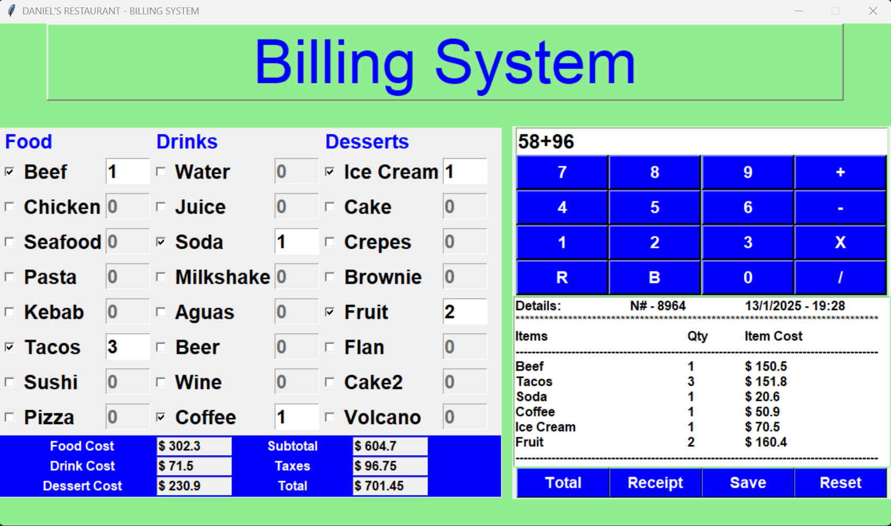

# Restaurant Payment System

A graphical user interface (GUI) application for a restaurant payment system built using Python's `tkinter` library. This project allows users to select items from a menu, calculate totals, generate receipts, and reset the application for new orders.

---

## Features

- **Menu Categories**: Includes sections for food, beverages, and desserts.
- **Interactive Selection**: Uses checkbuttons for item selection and input fields for quantities.
- **Calculator**: A built-in calculator for manual calculations.
- **Receipt Generation**: Displays a detailed receipt of the selected items and their costs.
- **Save Receipts**: Allows saving receipts for record-keeping.
- **Reset Functionality**: Clears all selections and inputs for a new session.

---

## Screenshots

---

## Prerequisites

Ensure you have the following installed:

- Python 3.x
- `tkinter`
